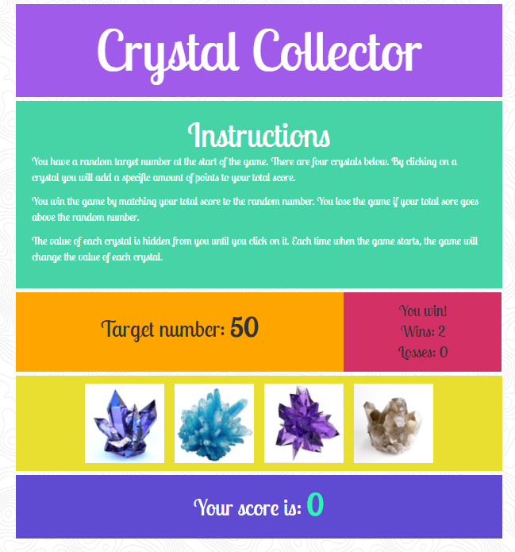

# Crystal-Game
Created a Crystal Collector Game. JavaScript was used to handle the game logic of assigning each crystal image a random value between 1 and 12, generating a random target value between 19 and 120, and tracking wins / losses.

**Technology used:** jQuery, JavaScript, HTML, and CSS.

### Rules of the Game
1. A random target number is generated at the start of the game between 19 and 120.
1. Each crystal image is assigned a random value between 1 and 12. These values are unknown to the user until the image is selected.
1. By clicking on the crystal images, the values are added to the user's total score.
1. The user wins the game by successfully adding up his/her score to equal the target number. The user loses when his/her score total is greater than the target number.
1. A new game will automatically begin once a round is won or lost.

Below is a screenshot of the game:
